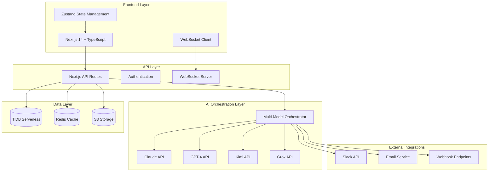
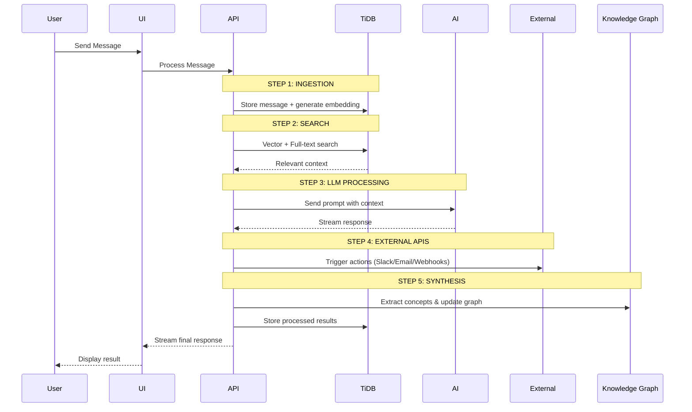

# Synapse Architecture

This document provides a detailed overview of the Synapse platform's architecture, including the high-level system design, data models, component hierarchy, and core workflows.

## High-Level System Architecture

The following diagram illustrates the main components of the Synapse platform and their interactions.



## Multi-Step AI Workflow

The core of Synapse is a multi-step workflow that processes user requests from ingestion to synthesis.



## TiDB Database Schema

The schema is designed to leverage TiDB's native vector and full-text search capabilities.

```sql
-- Conversations with title embeddings for semantic search
CREATE TABLE conversations (
  id VARCHAR(36) PRIMARY KEY,
  project_id VARCHAR(36),
  title TEXT NOT NULL,
  title_embedding VECTOR(1536),
  created_at TIMESTAMP DEFAULT CURRENT_TIMESTAMP,
  updated_at TIMESTAMP DEFAULT CURRENT_TIMESTAMP ON UPDATE CURRENT_TIMESTAMP,
  FULLTEXT(title),
  VECTOR INDEX idx_title_vec (title_embedding)
);

-- Branches with context embeddings for model switching
CREATE TABLE branches (
  id VARCHAR(36) PRIMARY KEY,
  conversation_id VARCHAR(36) NOT NULL,
  parent_branch_id VARCHAR(36),
  name VARCHAR(255) NOT NULL,
  model ENUM('claude', 'gpt4', 'kimi', 'grok') NOT NULL,
  context_summary TEXT,
  context_embedding VECTOR(1536),
  created_at TIMESTAMP DEFAULT CURRENT_TIMESTAMP,
  FOREIGN KEY (conversation_id) REFERENCES conversations(id) ON DELETE CASCADE,
  FULLTEXT(context_summary),
  VECTOR INDEX idx_context_vec (context_embedding)
);

-- Messages with content embeddings for semantic search
CREATE TABLE messages (
  id VARCHAR(36) PRIMARY KEY,
  branch_id VARCHAR(36) NOT NULL,
  role ENUM('user', 'assistant') NOT NULL,
  content TEXT NOT NULL,
  content_embedding VECTOR(1536),
  model VARCHAR(50),
  token_count INT DEFAULT 0,
  processing_time_ms INT DEFAULT 0,
  created_at TIMESTAMP DEFAULT CURRENT_TIMESTAMP,
  FOREIGN KEY (branch_id) REFERENCES branches(id) ON DELETE CASCADE,
  FULLTEXT(content),
  VECTOR INDEX idx_content_vec (content_embedding)
);

-- Documents for knowledge base
CREATE TABLE documents (
  id VARCHAR(36) PRIMARY KEY,
  project_id VARCHAR(36) NOT NULL,
  filename VARCHAR(255) NOT NULL,
  content LONGTEXT NOT NULL,
  content_embedding VECTOR(1536),
  metadata JSON,
  processed_at TIMESTAMP DEFAULT CURRENT_TIMESTAMP,
  FOREIGN KEY (project_id) REFERENCES projects(id) ON DELETE CASCADE,
  FULLTEXT(filename, content),
  VECTOR INDEX idx_doc_vec (content_embedding)
);

-- Concepts for knowledge graph generation
CREATE TABLE concepts (
  id VARCHAR(36) PRIMARY KEY,
  project_id VARCHAR(36) NOT NULL,
  name VARCHAR(255) NOT NULL,
  description TEXT,
  concept_embedding VECTOR(1536),
  mention_count INT DEFAULT 0,
  created_at TIMESTAMP DEFAULT CURRENT_TIMESTAMP,
  FOREIGN KEY (project_id) REFERENCES projects(id) ON DELETE CASCADE,
  FULLTEXT(name, description),
  VECTOR INDEX idx_concept_vec (concept_embedding)
);
```

## Component & Directory Structure

The project follows a feature-based organization within a standard Next.js App Router structure.

```
src/
├── app/                 # App Router: File-based routing, layouts, and pages.
├── components/          # Shared and reusable React components.
│   ├── ui/              # Atomic UI elements (Button, Card, Modal).
│   ├── layout/          # Structural components (Header, Sidebar).
│   ├── chat/            # Components for the core chat interface.
│   ├── branching/       # Components for branch visualization and management.
│   └── ...              # Other feature-specific components.
├── lib/                 # Core libraries and business logic.
│   ├── ai/              # AI model clients and orchestration logic.
│   ├── tidb/            # TiDB client, schema, and query utilities.
│   └── ...              # Auth, config, etc.
├── hooks/               # Custom React hooks for state and side-effects.
├── store/               # Zustand stores for global state management.
├── types/               # TypeScript type definitions.
└── styles/              # Global styles, Tailwind config, and themes.
```

## Error Handling & Testing

- **Error Handling:** The system uses a comprehensive error management strategy with custom error types, graceful fallbacks (e.g., vector search to full-text search), and retry mechanisms with exponential backoff.
- **Testing:** A multi-layer testing approach is used, including unit tests for database operations, integration tests for the multi-step workflow, performance tests for critical paths (<200ms vector search), and end-to-end tests for user scenarios.